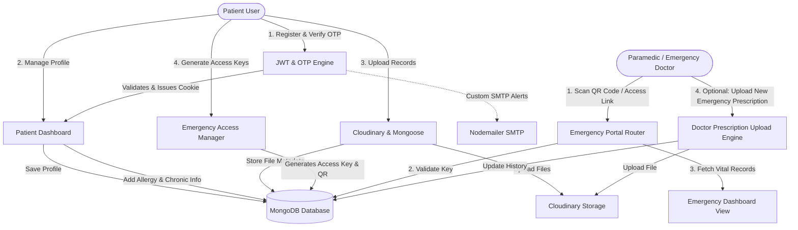

<h1 align="center">🏥 MyHealthRecord</h1>

<p align="center">
  <b>Secure E-Health Records & Emergency Bypass Share Platform</b>
</p>

<h2 align="center">🛠 Tech Stack</h2>

<p align="center">
  
</p>

<p align="center">
  
  
</p>

<p align="center">
  
</p>

- **Framework:** Next.js 16
- **UI:** React 19
- **Database:** MongoDB + Mongoose
- **Styling:** Tailwind CSS v4
- **Media Storage:** Cloudinary
- **Authentication:** JWT

**MyHealthRecord** is a modern, responsive, and secure electronic health records (EHR) management application. It bridges the gap between patient data ownership and emergency medical availability. Built with **Next.js**, **React**, **MongoDB**, and **Cloudinary**, it offers patients a digital healthcare passbook. It provides first responders (paramedics, emergency doctors) with a zero-login emergency bypass portal via secure access keys and QR codes.

---

## 🚀 Key Engineering & Architecture Highlights.

If you are showcasing this project on your resume, here are the core accomplishments and technical decisions to highlight:

*   **Zero-Session Emergency Access Bypass:** Developed a time-limited/token-based bypass route (`/emergencyAccess/[accessKey]`) allowing paramedics and doctors to scan QR codes and instantly view critical patient data (blood group, severe allergies, emergency contacts) without requiring a login session, while maintaining a strict read-only access policy.
*   **Dual-Flow Medical Document Pipeline:** Designed and integrated a media ingestion pipeline using **Cloudinary** and **Mongoose**. Patient-uploaded documents (scans, history) are securely stored in the cloud, while medical-grade prescriptions uploaded by authorized doctors under emergency access keys update the patient's record in real time.
*   **Custom JWT & OTP Security Engine:** Implemented a secure authentication layer using secure HTTP-only cookies, combined with a custom SMTP-based One-Time-Password (OTP) validation framework utilizing **NodeMailer** and Mongoose TTL (Time-To-Live) index schemas for auto-expiring codes.
*   **Comprehensive Safety Check Hooks:** Created safety tables (Allergies and Chronic Conditions) utilizing severe/moderate/mild interaction markers to automatically alert patients and providers before adding conflicting prescribed medications.
*   **Global State & Optimized Server Actions:** Utilized **Zustand** for lightweight client-side global state synchronization of user profiles and created custom API wrapper actions with **Axios** to manage multi-part forms and automated ZIP downloads for patient medical histories.

---

## 🗺️ System Working Flow


The diagram below outlines the core application architectures and interactions:



---

## 📂 Project Directory Structure

```
healthapp/
├── app/                              # Next.js App Router root
│   ├── actions/                      # Client API wrappers (Axios integration)
│   │   ├── auth.js                   # Authentication & Session helpers
│   │   ├── emergencyKey.js           # Emergency Access Key generator triggers
│   │   ├── recordsAction.js          # CRUD operations for medical & prescribed records
│   │   ├── userAction.js             # Profile management & allergy updates
│   │   └── verifyOtp.js              # OTP validator action
│   ├── api/                          # Next.js Server-Side API Routes (REST endpoints)
│   │   ├── auth/                     # Authentication (Login, signup, logout) endpoints
│   │   ├── contact/                  # Contact form emailing
│   │   ├── profile/                  # Profiles updates & key generation
│   │   └── records/                  # Medical records CRUD, zip-download & file retrieval
│   ├── components/                   # Reusable UI React Components (Tables, Modals)
│   │   ├── AllergyTable.jsx          # Interactive allergy list
│   │   ├── ChronicTable.jsx          # Chronic conditions tracking
│   │   ├── EmergencyAccessPage.jsx   # Client side key generation dashboard
│   │   ├── MedicalReportsTable.jsx   # List/View uploaded reports
│   │   ├── MedicationPage.jsx        # Patient medication log
│   │   └── PrescribedRecordsTable.jsx # Prescriptions table & doctor uploads
│   ├── emergencyAccess/              # Emergency Share routes
│   │   ├── [accessKey]/              # Paramedic / Emergency bypass view
│   │   └── page.jsx                  # Access key page parent router
│   ├── medication/                   # Medication details page
│   ├── patient/                      # Patient Dashboard route
│   │   └── _components/              # HomeClient dashboard layout
│   ├── records/                      # Medical records upload route
│   ├── store/                        # Zustand global state configurations
│   ├── ui/                           # Shaded Radix UI components
│   ├── layout.js                     # HTML root layout wrapper
│   └── page.js                       # Public landing page with features & contact forms
├── lib/                              # Utility helper modules (shared modules)
│   ├── checkUser.js                  # User verification helpers
│   ├── cloudinary.js                 # Cloudinary integration setup
│   ├── dbConnect.js                  # MongoDB connection pool manager
│   ├── fileUpload.js                 # Multi-part file buffer parsing
│   ├── nodemailer.js                 # SMTP server setup for mailings
│   ├── verifyFromExternalAPI.jsx     # External API validator
│   └── verifyUser.js                 # Custom JWT parser middleware
├── models/                           # Mongoose Database Schemas
│   ├── emergencyAccessKey.js         # Paramedic keys schema
│   ├── medicalRecord.js              # Uploaded file URLs & types metadata
│   ├── otp.js                        # OTP validation & TTL schemas
│   ├── prescribedRecord.js           # Medication records schema
│   ├── profile.js                    # Patient medical profiles schema
│   └── user.js                       # Auth credentials & status schema
├── public/                           # Static assets & icons
├── package.json                      # Build scripts, configurations & dependencies
├── tsconfig.json                     # TypeScript compiler configuration
└── next.config.mjs                   # Next.js configurations
```

---

## 🛠️ Tech Stack & Dependencies

*   **Framework:** Next.js 16 (App Router)
*   **Frontend Engine:** React 19, TailwindCSS v4, Lucide React (Icons)
*   **Database:** MongoDB with Mongoose (ODM)
*   **State Management:** Zustand
*   **File Storage:** Cloudinary SDK
*   **Mail Server:** Nodemailer (SMTP configuration)
*   **Security & Utils:** JSONWebToken (JWT) validation, bcryptjs (hashing), Axios, Archiver (ZIP packaging)

---

## ⚙️ Environment Configuration

Create a `.env` file in the root of `healthapp/` and configure the following variables:

```env
# MongoDB Connection
MONGODB_URI=your_mongodb_connection_string

# JWT Secret
JWT_SECRET=your_jwt_secret_key

# Cloudinary Credentials
CLOUDINARY_CLOUD_NAME=your_cloudinary_cloud_name
CLOUDINARY_API_KEY=your_cloudinary_api_key
CLOUDINARY_API_SECRET=your_cloudinary_api_secret

# Nodemailer SMTP Configuration
SMTP_HOST=your_smtp_host
SMTP_PORT=your_smtp_port
SMTP_USER=your_smtp_email
SMTP_PASSWORD=your_smtp_password
```

---

## 📦 Getting Started & Local Development

### Prerequisites

*   Node.js (v18 or higher)
*   npm or yarn

### Installation Steps

1.  **Clone the Repository:**
    ```bash
    git clone https://github.com/your-username/Resume-Project.git
    cd Resume-Project/health-care/healthapp
    ```

2.  **Install Dependencies:**
    ```bash
    npm install
    ```

3.  **Run Development Server:**
    ```bash
    npm run dev
    ```
